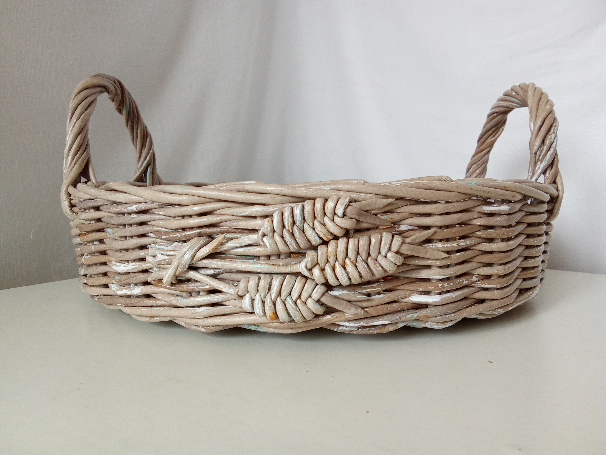

# Pletenie.Soul 🌿

Інтернет-магазин авторських виробів з паперової лози. Сайт створено для демонстрації, популяризації та продажу унікальних кошиків, сумок і декору ручної роботи.


_(Якщо зображення доступне у папці public)_

## 🛠 Технологічний стек

Проект побудовано на сучасному стеку технологій для забезпечення швидкодії, SEO-оптимізації та зручності підтримки:

- **Core:** [Next.js 15](https://nextjs.org/) (App Router)
- **Мова:** TypeScript
- **Стилізація:** [Tailwind CSS 4](https://tailwindcss.com/)
- **CMS:** [Sanity](https://www.sanity.io/) (керування контентом)
- **Іконки:** [Lucide React](https://lucide.dev/)

## ✨ Функціонал

- 🛍 **Каталог товарів:** Зручний перегляд виробів з фото, цінами та описами.
- 📱 **Адаптивність:** Povnyy Mobile-first дизайн, що ідеально виглядає на смартфонах.
- 💬 **Швидке замовлення:** Інтеграція з WhatsApp для прямого зв'язку з майстром.
- 🔍 **SEO:** Оптимізована структура для пошукових систем.
- 🎨 **UI/UX:** Мінімалістичний дизайн у стилі Scandi/Boho, що підкреслює естетику виробів.

## 🚀 Як запустити проект локально

1. **Клонуйте репозиторій:**

   ```bash
   git clone <repository-url>
   ```

2. **Встановіть залежності:**

   ```bash
   npm install
   ```

3. **Налаштуйте змінні середовища:**
   Створіть файл `.env.local` в корені проекту та додайте необхідні ключі (якщо використовуються, наприклад, для Sanity):

   ```env
   NEXT_PUBLIC_SANITY_PROJECT_ID=your_project_id
   NEXT_PUBLIC_SANITY_DATASET=production
   ```

4. **Запустіть сервер розробки:**

   ```bash
   npm run dev
   ```

5. **Відкрийте сайт:**
   Перейдіть за посиланням [http://localhost:3000](http://localhost:3000).

## 📂 Структура папок

- `src/app` — Сторінки додатка та макети (App Router).
- `src/components` — Перевикористовувані React-компоненти (Navbar, Her, ProductCard тощо).
- `src/lib` — Допоміжні функції (утиліти).
- `sanity` — Конфігураційні файли та схеми даних для Sanity CMS.

## 🤝 Контакти

**Pletenie.Soul** — Затишок, сплетений з любов'ю.

- Email: hello@pletenie.ua
- WhatsApp: [+38 (099) 000-00-00](https://wa.me/380990000000)

---

© 2024 Pletenie.Soul. Всі права захищено.
